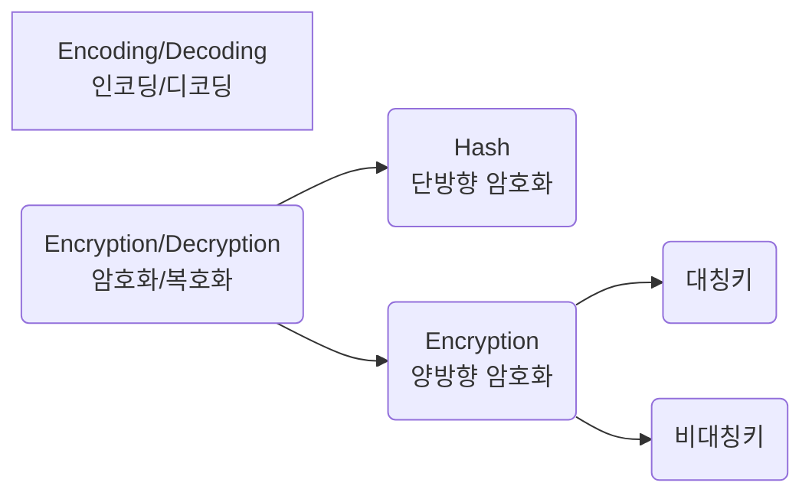
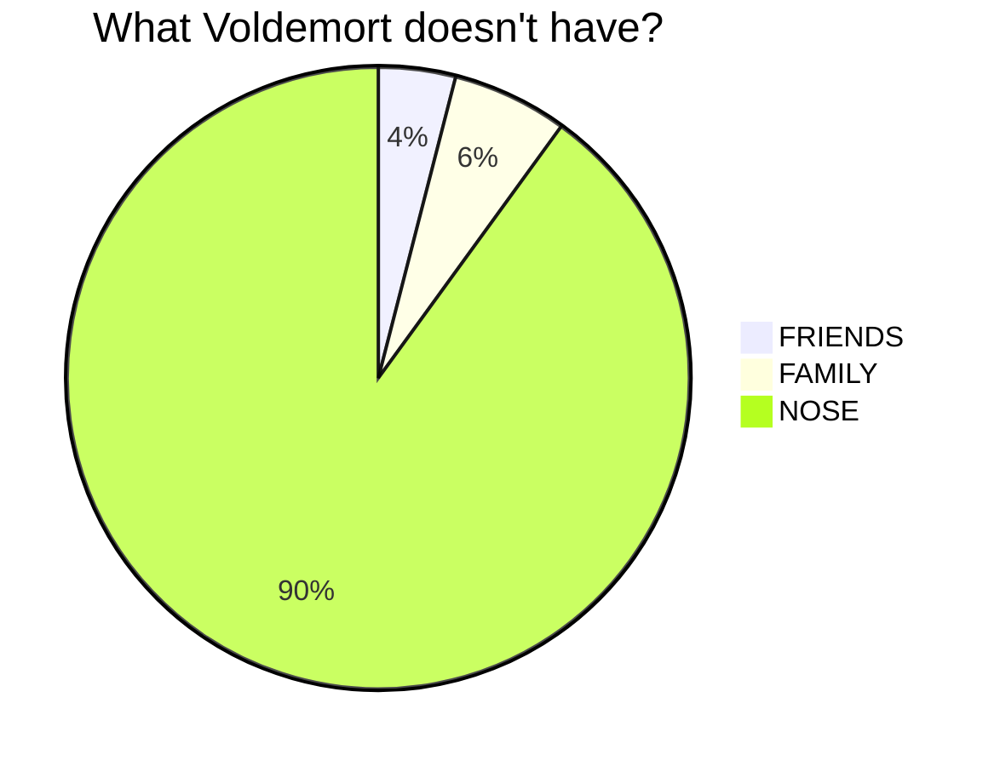
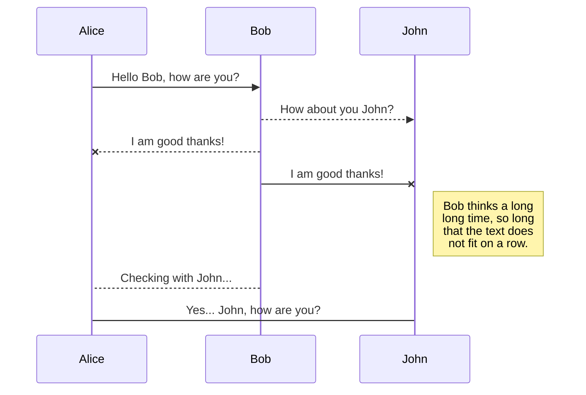
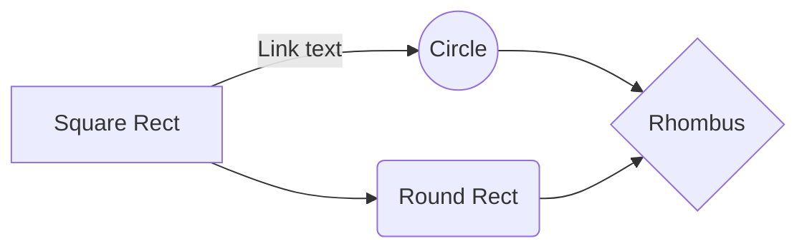

<script src="https://cdn.jsdelivr.net/npm/mermaid/dist/mermaid.min.js"></script>

# 0. 목차
* [1. 제목](#1-제목header)
* [2. 내용](#2-내용context)
* [3. 수평선](#3-수평선horizon)
* [4. 인용문](#4-인용문block-quote)
* [5. 목록](#5-목록list)
* [6. 링크](#6-링크link)
* [7. ID](#7-heading-ids)
* [8. 코드](#8-코드code)
* [9. 표](#9-표table)
* [10. 수식](#10-수식)
* [11. 이미지](#11-이미지image)
* [12. Emoji](#12-emoji)
* [13. 다이어그램](#13-다이어그램---mermaid)
* [14. HTML, CSS, JS](#14-html-css-js)
* [참고](#참고)

# 1. 제목(Header)
```
# h1
## h2
### h3
#### h4
##### h5
###### h6
```

# h1
## h2
### h3
#### h4
##### h5
###### h6

```

h1
===

h2
---

```

h1
===

h2
---

# 2. 내용(Context)
## 2.1. 강조(Emphasize)
```
이탤릭체: *이탤릭체*, _italic letters_, <i>이탤릭체</i>, <em>italic letters</em>  
두껍게: **두껍게**, __bold letters__ , <b>두껍게</b>, <strong>bold letters</strong>  
이탤릭체와 두껍게 같이: ***같이 사용하기***
취소선: ~~취소선~~ , <del>strikethrough</del>  
밑줄: <u>밑줄</u>, <ins>underline</ins>  
<acronym title="텍스트 가리키면 나오는 텍스트">텍스트</acronym>  
<abbr title="텍스트 가리키면 나오는 텍스트">줄 쳐진 텍스트</abbr>  
```

이탤릭체: *이탤릭체*, _italic letters_, <i>이탤릭체</i>, <em>italic letters</em>  
두껍게: **두껍게**, __bold letters__ , <b>두껍게</b>, <strong>bold letters</strong>  
굵은 이탤릭체: ***같이 사용하기***  
취소선: ~~취소선~~ , <del>strikethrough</del>  
밑줄: <u>밑줄</u>, <ins>underline</ins>  
<acronym title="텍스트 가리키면 나오는 텍스트">텍스트 가리키면 나오는 텍스트 1</acronym>  
<abbr title="텍스트 가리키면 나오는 텍스트">텍스트 가리키면 나오는 텍스트 2</abbr>  

## 2.2. 정렬
```
<center>중앙</center>  
<div style="text-align: center"> 중앙 </div>  
<div style="text-align: left"> 왼쪽 </div>  
<div style="text-align: right"> 오른쪽 </div> 
```

<center>중앙</center>  
<div style="text-align: center"> 중앙 </div>  
<div style="text-align: left"> 왼쪽 </div>  
<div style="text-align: right"> 오른쪽 </div>  

## 2.3. 첨자
~~Jekyll에서 적용 안 되는 듯~~  

```
H~2~O
X^2^
```

H~2~O  
X^2^  

---

```html
텍스트<sup>윗첨자</sup>  
텍스트<sub>밑첨자</sub>  
```

텍스트<sup>윗첨자</sup>  
텍스트<sub>밑첨자</sub>  

## 2.4. 주석
`<!-- 주석 -->`

## 2.5. 다음 줄로 넘어가기(New Line)
```
C/C++  <!-- 스페이스 두 번 -->
JAVA  <!-- 스페이스 두 번 -->
PYTHON  <!-- 스페이스 두 번 -->
R  <!-- 스페이스 두 번 -->
JAVA SCRIPT<br>
HTML<br>
CSS<br>
GO<br>
```

C/C++  <!-- 스페이스 두 번 -->
JAVA  <!-- 스페이스 두 번 -->
PYTHON  <!-- 스페이스 두 번 -->
R  <!-- 스페이스 두 번 -->
JAVA SCRIPT<br>
HTML<br>
CSS<br>
GO<br>

## 2.6. 하이하이트
```
안녕하세요. ==jekyll==에서는 적용 안 되는 듯하다.
```

안녕하세요. ==jekyll==에서는 적용 안 되는 듯하다.

```html
안녕하세요. 이 부분에 <mark>하이라이트</mark>를 할 겁니다.
```

안녕하세요. 이 부분에 <mark>하이라이트</mark>를 할 겁니다.

# 3. 수평선(Horizon)
```
***
---
___
```

***
---
___

# 4. 인용문(Block Quote)
```
> text
>> text
>>> text
> # text
```

> text
>> text
>>> text
> * text

# 5. 목록(List)ㅍ
## 5.1. Unordered List
```
* non-ordered list
    * 순서 없는 서브 목록
    + 순서 없는 서브 목록
    - 순서 없는 서브 목록
+ 순서 없는 목록
- 순서 없는 목록
```

* non-ordered list
    * 순서 없는 서브 목록
    + 순서 없는 서브 목록
    - 순서 없는 서브 목록
+ 순서 없는 목록
- 순서 없는 목록

---

```html
<ul>
    <li>Coffee</li>
    <li>Tea
        <ul>
        <li>Black tea</li>
        <li>Green tea</li>
        </ul>
    </li>
    <li>Milk</li>
</ul>
```

<ul>
    <li>Coffee</li>
    <li>Tea
        <ul>
        <li>Black tea</li>
        <li>Green tea</li>
        </ul>
    </li>
    <li>Milk</li>
</ul>

## 5.2. Ordered List
```
1. ordered sub list
    1. 순서 있는 서브 목록
    2. 순서 있는 서브 목록
    3. 순서 있는 서브 목록
10. 순서 있는 목록 <!-순서가 차례대로 자동으로 매겨짐>
```

1. ordered sub list
    1. 순서 있는 서브 목록
    2. 순서 있는 서브 목록
    3. 순서 있는 서브 목록
10. 순서 있는 목록

---

```html
<ol>
    <li>Coffee</li>
    <li>Tea
        <ol>
        <li>Black tea</li>
        <li>Green tea</li>
        </ol>
    </li>
    <li>Milk</li>
</ol>
```

<ol>
    <li>Coffee</li>
    <li>Tea
        <ol>
        <li>Black tea</li>
        <li>Green tea</li>
        </ol>
    </li>
    <li>Milk</li>
</ol>

## 5.3. Definition List
```
First Term
: This is the definition of the first term.

Second Term
: This is one definition of the second term.
: This is another definition of the second term.
```

First Term
: This is the definition of the first term.

Second Term
: This is one definition of the second term.
: This is another definition of the second term.

---

```html
<dl>
    <dt>First Term</dt>
    <dd>This is the definition of the first term.</dd>
    <dt>Second Term</dt>
    <dd>This is one definition of the second term. </dd>
    <dd>This is another definition of the second term.</dd>
</dl>
```

<dl>
    <dt>First Term</dt>
    <dd>This is the definition of the first term.</dd>
    <dt>Second Term</dt>
    <dd>This is one definition of the second term. </dd>
    <dd>This is another definition of the second term.</dd>
</dl>

## 5.4. Task List

```
- [x] 순서없는 리스트에서
- [ ] 대괄호를 추가하고
- [ ] 체크는 X로 하면 된다.
```

- [x] 순서없는 리스트에서
- [ ] 대괄호를 추가하고
- [ ] 체크는 X로 하면 된다.

# 6. 링크(Link)
```
* 주소를 보여주고만 싶을 때: https://google.com  
* 링크만 있는 inline 링크: <http://www.naver.com>  
* [설명 있는 inline 링크 1](https://google.com)  
* <a href="http://www.youtube.com">설명 있는 inline 링크 2</a>  
* [갖다 대면 텍스트 뜨는 inline 링크 1](https://www.youtube.com "유튜브")  
* <a href="http://www.youtube.com" title="Youtube">갖다 대면 텍스트 뜨는 inline 링크 2</a>  
* [내가 작성한 다른 post로 넘어가고 싶을 때](./2021-11-30-github%EB%B8%94%EB%A1%9C%EA%B7%B8_%EB%8A%90%EB%82%80%EC%A0%90.md)  
* 이렇게도 [갖다 대면 텍스트 뜨는 설명 있는 inline 링크인데 링크를 다른 곳에 빼 놓음]를 타고 갈 수 있다고 하네요.  
* [링크 다른 곳에 써놓기 1][Naver Link]  
* [링크 다른 곳에 써놓기 2][1]  

[Naver Link]: https://www.naver.com/
[1]: https://github.com/
[갖다 대면 텍스트 뜨는 설명 있는 inline 링크인데 링크를 다른 곳에 빼 놓음]: https://google.com "구글"
```

* 주소를 보여주고만 싶을 때: https://google.com  
* 링크만 있는 inline 링크: <http://www.naver.com>  
* [설명 있는 inline 링크 1](https://google.com)  
* <a href="http://www.youtube.com">설명 있는 inline 링크 2</a>  
* [갖다 대면 텍스트 뜨는 inline 링크 1](https://www.youtube.com "유튜브")  
* <a href="http://www.youtube.com" title="Youtube">갖다 대면 텍스트 뜨는 inline 링크 2</a>  
* [내가 작성한 다른 post로 넘어가고 싶을 때](./2021-11-30-github%EB%B8%94%EB%A1%9C%EA%B7%B8_%EB%8A%90%EB%82%80%EC%A0%90.md)  
* 이렇게도 [갖다 대면 텍스트 뜨는 설명 있는 inline 링크인데 링크를 다른 곳에 빼 놓음]를 타고 갈 수 있다고 하네요.  
* [링크 다른 곳에 써놓기 1][Naver Link]  
* [링크 다른 곳에 써놓기 2][1]  

[Naver Link]: https://www.naver.com/
[1]: https://github.com/
[갖다 대면 텍스트 뜨는 설명 있는 inline 링크인데 링크를 다른 곳에 빼 놓음]: https://google.com "구글"

# 7. Heading IDs
```md
### My Great Heading {#custom-id}
```

위처럼 쓰면 html에서 이렇게 적용된다.

```html
<h3 id="custom-id">My Great Heading</h3>
```

## 7.1. 응용(ID로 링크 걸기)
```
* [1. 제목](#1-제목header)
* [2. 내용](#2-내용context)
* [3. 수평선](#3-수평선horizon)
* [4. 인용문](#4-인용문block-quote)
* [5. 목록](#5-목록list)
* [6. 링크](#6-링크link)
* [7. ID](#7-heading-ids)
* [8. 코드](#8-코드code)
* [9. 표](#9-표table)
* [10. 수식](#10-수식)
* [11. 이미지](#11-이미지image)
* [12. 다이어그램](#12-다이어그램---mermaid)
* [13. HTML, CSS, JS](#13-html-css-js)
* [참고](#참고)
```

* [1. 제목](#1-제목header)
* [2. 내용](#2-내용context)
* [3. 수평선](#3-수평선horizon)
* [4. 인용문](#4-인용문block-quote)
* [5. 목록](#5-목록list)
* [6. 링크](#6-링크link)
* [7. ID](#7-heading-ids)
* [8. 코드](#8-코드code)
* [9. 표](#9-표table)
* [10. 수식](#10-수식)
* [11. 이미지](#11-이미지image)
* [12. 다이어그램](#12-다이어그램---mermaid)
* [13. HTML, CSS, JS](#13-html-css-js)
* [참고](#참고)

# 8. 코드(Code)
## 8.1. 인라인(inline)
```
`print("Hello, World!")`
```

`print("Hello, World!")`

## 8.2. 블록(block)
Highlighting을 적용시키기 위해서는 ``` 옆에 알맞는 language를 적어주면 된다.  

````
``` python
while (True):
    print("마크다운 나 짜증나게 하지마")
```
````
  
``` python
while (True):
    print("마크다운 나 짜증나게 하지마")
```

---

````
``` java
public static void main(String[] args) {
    while (true) {
        System.out.println("마크다운 나 짜증나게 하지마");
    }
}
```
````

``` java
public static void main(String[] args) {
    while (true) {
        System.out.println("마크다운 나 짜증나게 하지마");
    }
}
```

---

````
``` c
#include <stdio.h>

for (int i = 0; i++; i>10) {
    printf("Hello World!");
}

return 0;
```
````

``` c
#include <stdio.h>

for (int i = 0; i++; i>10) {
    printf("Hello World!");
}

return 0;
```

# 9. 표(Table)
```
| 1st | 2nd | 3rd |
| --- | --- | --- |
| 한자 | 심리학 | 수치해석학 |
| 선형대수학 | 통계학 | 이산수학 |
| 컴퓨터 구조 | 토익 | 파이썬 |
```

| 1st | 2nd | 3rd |
| --- | --- | --- |
| 한자 | 심리학 | 수치해석학 |
| 선형대수학 | 통계학 | 이산수학 |
| 컴퓨터 구조 | 토익 | 파이썬 |

---

```
| 1st | 2nd | 3rd |
| :--- | :---: | ---: |
| 좌로 정렬 | 가운데 정렬 | 우로 정렬 |
| 선형대수학 | 통계학 | 이산수학 |
| 컴퓨터 구조 | 토익 | 파이썬 |
```

| 1st | 2nd | 3rd |
| :--- | :---: | ---: |
| 좌로 정렬 | 가운데 정렬 | 우로 정렬 |
| 선형대수학 | 통계학 | 이산수학 |
| 컴퓨터 구조 | 토익 | 파이썬 |

---

``` html
<table>
    <thead>
        <tr>
            <th>1st</th>
            <th>2nd</th>
            <th>3rd</th>
        </tr>
    </thead>
    <tbody>
        <tr>
            <td colspan = "2">2열 병합</td>
            <!-- <td>가운데 정렬</td> -->
            <td style = "text-align: right">우로 정렬</td>
        </tr>
        <tr>
            <td rowspan = "2">2행 병합</td>
            <td style = "text-align: center">가운데 정렬</td>
            <td style = "text-align: left">좌로 정렬</td>
        </tr>
        <tr>
            <!-- <td>컴퓨터 구조</td> -->
            <td>토익</td>
            <td>파이썬</td>
        </tr>
    </tbody>
</table>
```

<table>
    <thead>
        <tr>
            <th>1st</th>
            <th>2nd</th>
            <th>3rd</th>
        </tr>
    </thead>
    <tbody>
        <tr>
            <td colspan = "2">2열 병합</td>
            <!-- <td>가운데 정렬</td> -->
            <td style = "text-align: right">우로 정렬</td>
        </tr>
        <tr>
            <td rowspan = "2">2행 병합</td>
            <td style = "text-align: center">가운데 정렬</td>
            <td style = "text-align: left">좌로 정렬</td>
        </tr>
        <tr>
            <!-- <td>컴퓨터 구조</td> -->
            <td>토익</td>
            <td>파이썬</td>
        </tr>
    </tbody>
</table>

# 10. 수식
~~수식 같은 경우에는 다른 프로그램에서 수식을 작성하고 캡처해서 사진으로 붙여넣는 게 빠르다~~

```
$$f(x)= if x < x_{min} : (x/x_{min})^a$$  
$$otherwise : 0$$  
$$P(w)=U(x/2)(7/5)/Z$$  
$$p_{\theta}(x) = \int p_{\theta}(2z)p_{\theta}(y\mid k)dz$$  
$$x = argmax_k((x_t-x_u+x_v)^T*x_m)/(||x_b-x_k+x_l||)$$  
```

$$f(x)= if x < x_{min} : (x/x_{min})^a$$  
$$otherwise : 0$$  
$$P(w)=U(x/2)(7/5)/Z$$  
$$p_{\theta}(x) = \int p_{\theta}(2z)p_{\theta}(y\mid k)dz$$  
$$x = argmax_k((x_t-x_u+x_v)^T*x_m)/(||x_b-x_k+x_l||)$$  

# 11. 이미지(Image)
이미지의 빠른 로딩을 위해 CDN을 적용해주는 것이 좋다.  
CDN 적용 사이트: [JSDELIVR](https://www.jsdelivr.com/github)
```
")
```

")

---

```

```


---

```
![세 번째 이미지][이미지 링크]
```

![세 번째 이미지][이미지 링크]

---

```
<!-- 이 넘은 사진 클릭하면 링크 탐 -->
[](https://www.google.no/)
```

이 넘은 사진 클릭하면 링크 탐
[](https://www.google.no/)

---

```

```


---

```
[이미지 링크]: https://cdn.pixabay.com/photo/2023/01/14/18/17/hot-air-balloon-7718789_960_720.jpg  "세 번째 이미지"
```

[이미지 링크]: https://cdn.pixabay.com/photo/2023/01/14/18/17/hot-air-balloon-7718789_960_720.jpg  "세 번째 이미지"

# 12. Emoji
정적 사이트 생성기를 사용하고 있다면, HTML page 인코딩을 UTF-8로 해야 한다.

## 12.1. Emoji 붙여넣기
1. [Emojipedia](https://emojipedia.org/): img 형태로 복사된다.


2. [twitter-symbols](https://kr.piliapp.com/twitter-symbols/): emoji 형태로 복사된다
🙃

## 12.2. Shortcode 사용하기
~~Jekyll에서 적용 안 되는 듯~~
```
Gone camping! :tent: Be back soon.
That is so funny! :joy:
```

Gone camping! :tent: Be back soon.  
That is so funny! :joy:  
[Emoji Shortcodes 목록](https://gist.github.com/rxaviers/7360908)

# 13. 다이어그램 -> mermaid
Pages는 Mermaid가 적용되지 않아서 HTML 요소를 사용해서 처리해야 한다
그렇기 때문에 포스트 맨 위와
```HTML
<script src="https://cdn.jsdelivr.net/npm/mermaid/dist/mermaid.min.js"></script>
```
맨 아래에
``` HTML
<script>
mermaid.initialize({startOnLoad:true});
window.mermaid.init(undefined, document.querySelectorAll('.language-mermaid'));
</script>
```
를 적용해줘야 한다

---

````

````


---

```
~~~ mermaid
graph LR
A[Encoding/Decoding<br>인코딩/디코딩]
B(Encryption/Decryption<br>암호화/복호화) --> C(Hash<br>단방향 암호화)
B --> D(Encryption<br>양방향 암호화)
D --> E(대칭키)
D --> F(비대칭키)
~~~
```

~~~ mermaid
graph LR
A[Encoding/Decoding<br>인코딩/디코딩]
B(Encryption/Decryption<br>암호화/복호화) --> C(Hash<br>단방향 암호화)
B --> D(Encryption<br>양방향 암호화)
D --> E(대칭키)
D --> F(비대칭키)
~~~

---

````

````


---

````

````


---

````

````


---

````

````


참고 사이트에 종류가 더 있으니 직접 확인하는 걸 추천한다

# 14. HTML, CSS, JS
마크다운에 HTML, CSS, JS 문법을 적용시킬 수 있다.  
HTML의 각종 태그, <style>, <script>로 감싸고 그 안에 각각의 문법에 맞는 코드를 작성하면 된다.  
태그로 감싸져 있는 부분은 마크다운 문법 적용이 안 된다.  

# 참고
* [Markdown Syntax 1](http://taewan.kim/post/markdown/#comment)
* [Markdown Syntax 2](https://cizz3007.github.io/%EB%A7%88%ED%81%AC%EB%8B%A4%EC%9A%B4/%EB%AC%B8%EB%B2%95/markdown/2018/04/08/markdown/)
* [Markdown Syntax 3](https://gist.github.com/ihoneymon/652be052a0727ad59601)
* [Markdown Syntax 4](https://theorydb.github.io/envops/2019/05/22/envops-blog-how-to-use-md/)
* [Markdown Syntax 5](https://heropy.blog/2017/09/30/markdown/)
* [Markdown Syntax 6](https://theorydb.github.io/envops/2019/05/22/envops-blog-how-to-use-md/)
* [Markdown Syntax 7](https://www.heropy.dev/p/B74sNE)
* [Markdown Syntax(RAW HTML) 8](https://raw.githubusercontent.com/TaylanTatli/Moon/master/_posts/2016-03-20-markdown-syntax.md)
* [Markdown Syntax 9](https://www.markdownguide.org/extended-syntax/#footnotes)
* [Markdown Syntax 10](https://velog.io/@yuuuye/velog-%EB%A7%88%ED%81%AC%EB%8B%A4%EC%9A%B4MarkDown-%EC%9E%91%EC%84%B1%EB%B2%95)
* [Markdown 각주, 미주](https://lynmp.com/ko/article/nu86c16d8f09c9fbd8)
* [Markdown Mermaid(Diagram)](https://mystria.github.io/archivers/apply-mermaid-diagram-to-github-pages)
* [Mermaid(Diagram) Syntax](https://mermaid.js.org/syntax/examples.html)
* [HTML table 병합](https://hianna.tistory.com/442)
* [HTML <table>, <tr>, <th>, <td>](https://jinnnkcoding.tistory.com/106)
* [HTML <th>](https://www.tcpschool.com/html-tags/th)
* [HTML <li>](https://tcpschool.com/html-tag-attrs/li-value)
* [HTML <ul>](https://www.w3schools.com/tags/tag_ul.asp)
* [HTML <ol>](https://developer.mozilla.org/en-US/docs/Web/HTML/Element/ol)
* [HTML <dl>](https://developer.mozilla.org/ko/docs/Web/HTML/Element/dl)
* [Image Loading 시간](https://derek-mun.com/contents/Contents-Github-page-image-loading-speed.html)
* [Github Blog 느린 웹 해결하기](https://chinsun9.github.io/2021/05/31/%EA%B9%83%ED%97%88%EB%B8%8C-%EB%B8%94%EB%A1%9C%EA%B7%B8-%EB%8A%90%EB%A6%B0-%EC%9B%B9-%ED%95%B4%EA%B2%B0%ED%95%98%EA%B8%B0/#%EC%83%81%ED%99%A9)

<script>
mermaid.initialize({startOnLoad:true});
window.mermaid.init(undefined, document.querySelectorAll('.language-mermaid'));
</script>