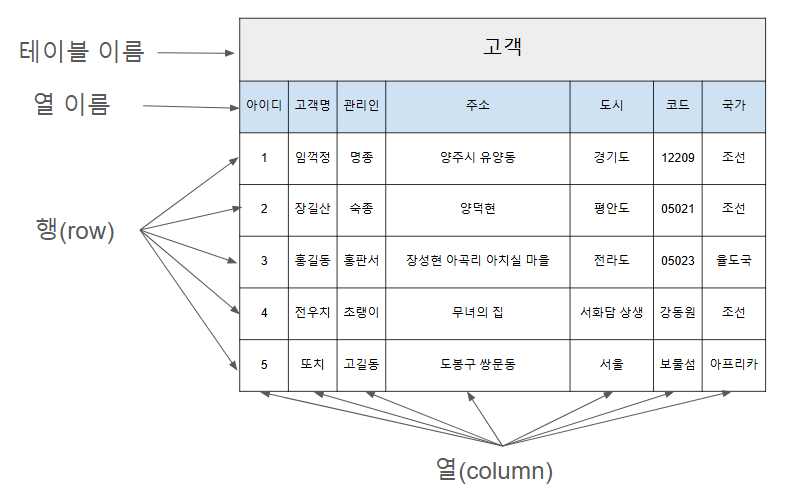

# 데이터베이스와 DBMS
* 데이터베이스: 데이터를 효율적으로 관리하기 위해 구조화한 데이터 집합
-> 예시를 들어 설명하자면 데이터베이스가 Excel 파일이라면 테이블은 Excel 시트다.  
* DBMS(Data Base Management System): 데이터베이스를 운영 및 관리. 계층형, 망형, 관계형 등 다양한 종류의 DBMS가 존재하며 대부분 관계형 DBMS(RDMBS)의 형태로 사용되고 있다. RDBMS의 데이터베이스는 하나 이상의 행(row)과 열(column)로 이루어진 테이블 형식을 데이터를 제공한다.
-> DBMS는 엑셀 프로그램 그 자체로 예를 들 수 있겠다.
아래는 데이터베이스 테이블 구조 예시

# SQL(Structed Query Language)
SQL: 데이터베이스에서 질의, 수정, 삭제 등의 작업을 하는 데이터베이스 관리용 언어이다.
~~WAS가 DB한테 Query를 통해 명령을 알아서 하도록 만든다.~~

## 언어적 특성
1. 대소문자를 가리지 않는다
1. SQL 쿼리문은 반드시 세미콜론(;)으로 끝나야 한다
1. 고유값을 가지는 문자열의 경우 홑따옴표(')로 감싸준다
4. 주석은 한 줄 주석의 경우 --로 나타내고 여러 줄 주석은 /* */로 감싸서 표현한다.

## SQL 문법 구분
<table>
    <thead>
        <tr>
            <td>종류</td>
            <td>명령어</td>
            <td>설명</td>
        </tr>
    </thead>
    <tbody>
        <tr>
            <td>데이터 정의어</td>
            <td>CREATE 
            ALTER 
            DROP 
            TRUNCATE</td>
            <td>스키마, 테이블, 도메인, 뷰, 인덱스 생성/변경/삭제할 때 사용</td>
        </tr>
        <tr>
            <td>데이터 제어어</td>
            <td>COMMIT 
            ROLLBACK 
            GRANT 
            REVOKE</td>
            <td>데이터에 대한 접근 권한 부여 등 관리 목적으로 사용</td>
        </tr>
        <tr>
            <td>데이터 조작어</td>
            <td>SELECT 
            INSERT 
            UPDATE 
            DELETE</td>
            <td>데이터베이스에 저장된 데이터를 실질적으로 처리하는 데 사용 
            (데이터 조회/추가/수정/삭제 등)</td>
        </tr>
    </tbody>
</table>

데이터베이스를 조회하고 관리하는 데이터 조작어가 가장 많이 쓰이며, 공격자의 주요 공격 포인트가 된다.

## 데이터 조작어 사용법
### SELECT: 데이터베이스의 데이터를 조회하거나 검색하기 위한 명령어
SELECT [column] FROM [table] WHERE [condition];

### INSERT INTO: 데이터베이스에 데이터를 추가하기 위한 명령어
INSERT INTO [table] VALUES [(data1, data2, ...)];

### UPDATE: 데이터베이스의 데이터 수정을 위한 명령어
UPDATE [table] SET [field1 = data1, field2 = data2...];

### DELETE: 데이터베이스의 데이터 삭제를 위한 명령어
DELETE FROM [table] WHERE [filed = data];

# 참고
* [SQL이란?](https://ko.wikipedia.org/wiki/SQL)
* [What is an index in SQL?](https://stackoverflow.com/questions/2955459/what-is-an-index-in-sql)
* [SK 쉴더스 인사이트 리포트](https://www.skshieldus.com/kor/media/newsletter/insight.do) 2022년 4월호 - 웹 취약점과 해킹 매커니즘 #2 SQL Injection 개요