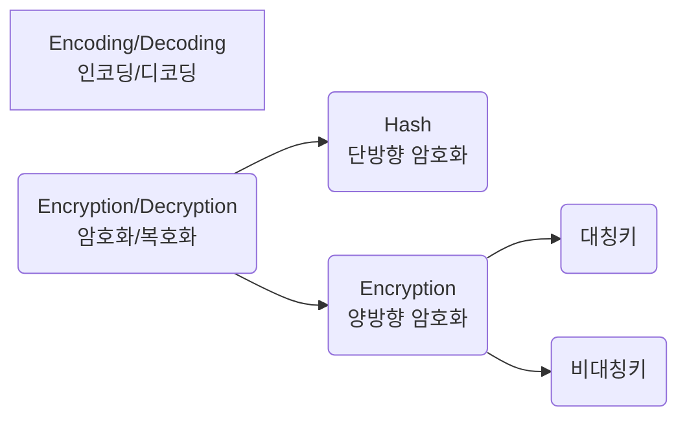

# 개요

# 1. 인코딩/디코딩
## 인코딩(Encoding)
1. 사람이 인지할 수 있는 형태의 데이터를
2. 약속된 규칙에 의해
3. 컴퓨터가 사용하는 0과 1로
4. 변환하는 과정

## 디코딩(Decoding)
인코딩의 역순!

# 2. 암호화/복호화
* 암호문(Cyper Text): 비밀을 유지하기 위해 당사자만 알 수 있도록 꾸민 약속 기호
* 평문(Plain Text): 누구나 알 수 있게 쓴 일반적인 글
* 암호화(Encryption): 평문을 암호문으로 바꾸는 것
* 복호화(Decryption): 암호문을 평문으로 바꾸는 것
* 암호화 알고리즘(Encryption Algorithm): 암호화나 복호화를 수행할 때 양쪽이 알고 있어햐 할 수단
* 암호화 키(Encryption Key): 약속한 규칙

## 2.1. 단방향 암호화(One Way Encryption)
* 암호화: 평문 -> 암호문 **가능**
* 복호화: 암호문 -> 평문 **불가능**
e.g. Hash, 
<abbr title="Message Authentication Code">MAC</abbr> 등

### 해시(Hash)
* 하나의 문자열을 특정한 길이의 특정한 값으로 변경한다
* 평문의 길이에 상관없이 해시 결과에 나타나는 길이는 모두 같다.
* 평문이 아주 조금만 달라도 결과를 추측하기 불가능할 정도로 다른 값이 나타난다.

## 2.2. 양방향 암호화
* 암호화: 평문 -> 암호문 **가능**
* 복호화: 암호문 -> 평문 **가능**
양방향 암호화는 크게 대칭키와 비대칭키 방식으로 나눠진다.

### 대칭키(비공개키)
* 특징: 암호화/복호화에 서로 동일한 키가 사용된다.
* 장점: 속도가 빠르다.
* 단점: 암호문을 만든 사람이 복호화할 사람에게 암호화 키를 전달해야 한다.
* e.g. <abbr title = "Data Encryption Standard">DES</abbr>, 
Triple DES, 
<abbr title = "Advanced Encryption Standard">AES</abbr>, 
SEED, ARIA, BB84, 
<abbr title = "International Data Encryption Algorithm">IDEA</abbr>, 
<abbr title = "Ron's Code 5">RC5</abbr>, 
Skipjack, 
<abbr title = "Lightweight Encryption Algorithm">LEA</abbr> 등

### 비대칭키(공개키)
* 특징: 암호화/복호화에 서로 다른 키가 사용된다.
* 장점: 대칭키(비공개키) 방식에 비해 느리다.
* 단점: 암호문을 만든 사람이 복호화할 사람에게 암호화 키를 전달할 필요가 없다.
* e.g. <abbr title="Rivert, Sharmir, Adleman">RSA</abbr> 등

* 서로 다른 키를 가지고 어떻게 복호화할 수 있느냐?

-> 이런 방식으로 서로 같은 키를 공유할 수 있다!

# 참고
* [인코딩](https://namu.wiki/w/%EC%9D%B8%EC%BD%94%EB%94%A9)
* [암호화](https://raonctf.com/essential/study/web/cryptography)
* [복호화](https://namu.wiki/w/%EB%B3%B5%ED%98%B8%ED%99%94)
* [인/디코딩, 해시, 암/복호화 1](https://meongae.tistory.com/96)
* [인/디코딩, 해시, 암/복호화 2](https://velog.io/@dainel/%EC%9D%B8%EC%BD%94%EB%94%A9-%ED%95%B4%EC%8B%B1-%EC%95%94%ED%98%B8%ED%99%94%EC%97%90-%EB%8C%80%ED%95%9C-%EC%9D%B4%ED%95%B4)
* [단방향 암호화](https://hyunseo-fullstackdiary.tistory.com/127)
* [단/양방향 암호화 1](https://velog.io/@kdh10806/%EB%8B%A8%EB%B0%A9%ED%96%A5-%EC%95%94%ED%98%B8%ED%99%94-%EC%96%91%EB%B0%A9%ED%96%A5-%EC%95%94%ED%98%B8%ED%99%94)
* [단/양방향 암호화 2](https://javaplant.tistory.com/26)
* [단/양방향 암호화 3](https://velog.io/@kdh10806/%EB%8B%A8%EB%B0%A9%ED%96%A5-%EC%95%94%ED%98%B8%ED%99%94-%EC%96%91%EB%B0%A9%ED%96%A5-%EC%95%94%ED%98%B8%ED%99%94)
* [단/양방향 암호화 4](https://0boss.tistory.com/71)
* \<정보보안 개론\> - 양대일

