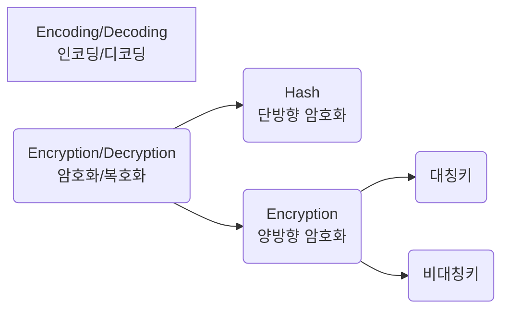

# 개요

graph LR
A[Encoding/Decoding 인코딩/디코딩]
B(Encryption/Decryption 암호화/복호화) --> C(Hash 단방향 암호화)
B --> D(Encryption 양방향 암호화)
D --> E(대칭키)
D --> F(비대칭키)

~~~ mermaid
graph LR
A[Encoding/Decoding 인코딩/디코딩]
B(Encryption/Decryption 암호화/복호화) --> C(Hash 단방향 암호화)
B --> D(Encryption 양방향 암호화)
D --> E(대칭키)
D --> F(비대칭키)
~~~

# 인코딩/디코딩
* **인코딩(Encoding)**: 사람이 인지할 수 있는 형태의 데이터를 약속된 규칙에 의해 컴퓨터가 사용하는 0과 1로 변환하는 과정
* **디코딩(Decoding)**: 인코딩의 역순

# 암호화/복호화
* **암호화(Encryption)**: 특별한 지식을 소유한 사람들을 제외하고는 누구든지 읽어볼 수 없도록 알고리즘을 이용하여 정보를 전달하는 과정
* **복호화(Decryption)**: 이를 역행하는 과정

## 단방향 암호화
한 번 암호화를 하면 복호화가 불가능하다.
대표적인 방식으로 해시가 있다.
### 해시
입력 데이터의 크기와 상관없이 항상 같은 크기의 결과를 얻는다

## 양방향 암호화

### 대칭키

### 비대칭키

# 참고
[인코딩](https://namu.wiki/w/%EC%9D%B8%EC%BD%94%EB%94%A9)
[복호화](https://namu.wiki/w/%EB%B3%B5%ED%98%B8%ED%99%94)
[인/디코딩, 해시, 암/복호화 1](https://meongae.tistory.com/96)
[인/디코딩, 해시, 암/복호화 2](https://velog.io/@dainel/%EC%9D%B8%EC%BD%94%EB%94%A9-%ED%95%B4%EC%8B%B1-%EC%95%94%ED%98%B8%ED%99%94%EC%97%90-%EB%8C%80%ED%95%9C-%EC%9D%B4%ED%95%B4)
[암호화](https://raonctf.com/essential/study/web/cryptography)

