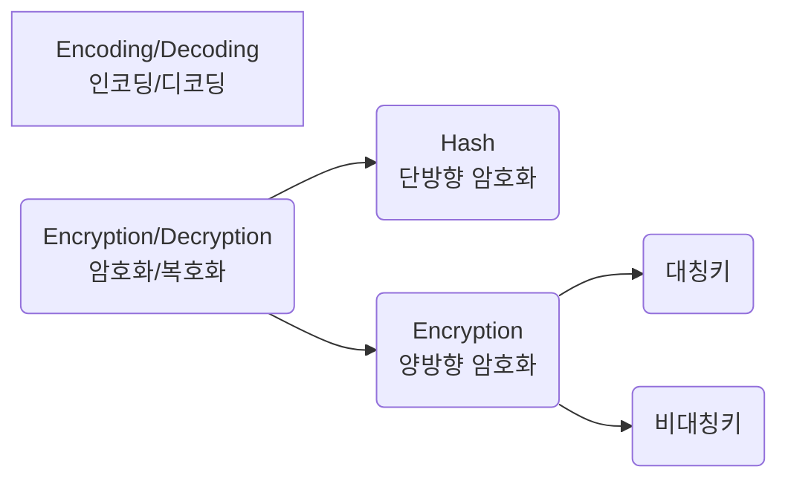

# 개요

# 1. 인코딩/디코딩
## 인코딩(Encoding)
1. 사람이 인지할 수 있는 형태의 데이터를
2. 약속된 규칙에 의해
3. 컴퓨터가 사용하는 0과 1로
4. 변환하는 과정

## 디코딩(Decoding)
인코딩의 역순!

# 2. 암호화/복호화
* 암호문(Cyper Text): 비밀을 유지하기 위해 당사자만 알 수 있도록 꾸민 약속 기호
* 평문(Plain Text): 누구나 알 수 있게 쓴 일반적인 글
* 암호화(Encryption): 평문을 암호문으로 바꾸는 것
* 복호화(Decryption): 암호문을 평문으로 바꾸는 것
* 암호화 알고리즘(Encryption Algorithm): 암호화나 복호화를 수행할 때 양쪽이 알고 있어햐 할 수단
* 암호화 키(Encryption Key): 약속한 규칙

## 2.1. 단방향 암호화(One Way Encryption)
한 번 암호화를 하면 **복호화가 불가능**하다.  
e.g. hash, MAC 등

### 해시(Hash)
하나의 문자열을 특정한 길이의 특정한 값으로 변경한다  
평문의 길이에 상관없이 해시 결과에 나타나는 길이는 모두 같다.  
평문이 아주 조금만 달라도 결과를 추측하기 불가능할 정도로 다른 값이 나타난다.  

## 2.2. 양방향 암호화

### 대칭키

### 비대칭키

# 참고
[인코딩](https://namu.wiki/w/%EC%9D%B8%EC%BD%94%EB%94%A9)
[복호화](https://namu.wiki/w/%EB%B3%B5%ED%98%B8%ED%99%94)
[인/디코딩, 해시, 암/복호화 1](https://meongae.tistory.com/96)
[인/디코딩, 해시, 암/복호화 2](https://velog.io/@dainel/%EC%9D%B8%EC%BD%94%EB%94%A9-%ED%95%B4%EC%8B%B1-%EC%95%94%ED%98%B8%ED%99%94%EC%97%90-%EB%8C%80%ED%95%9C-%EC%9D%B4%ED%95%B4)
[암호화](https://raonctf.com/essential/study/web/cryptography)

