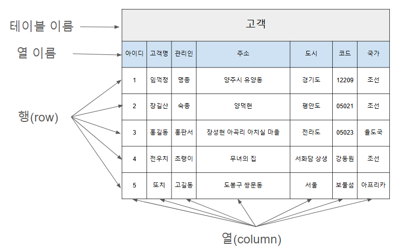

# 출력
## 1. document.getElementById().innerHTML
```html
<body>
    <p id="test"></p>
    <script>
        //id로 html요소(elem) 접근
        let elem = document.getElementById("test");
        // elem의 innerHTML 속성을 통해 내용 적용
        elem.innerHTML = "10" + 1;
    </script>
</body>
```


## 2. console.log()
```html
<body>
 	<h2>console.log 예시</h2>
  	<p>Hello, Javascript!</p>
  	
	<script type="text/javascript">
	    console.log("Hello, Javascript!");
	</script>
</body>
```

## 3. document.write()
```js

```

## 4. alert()
```js

```

# 참고
* [](https://jinnnkcoding.tistory.com/140)
* []()
* []()
* []()